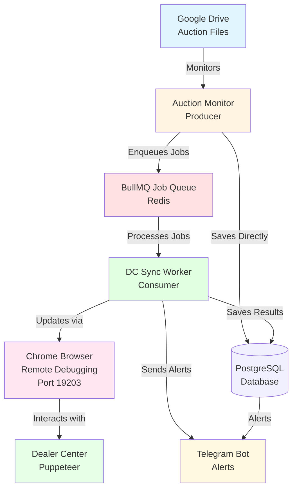
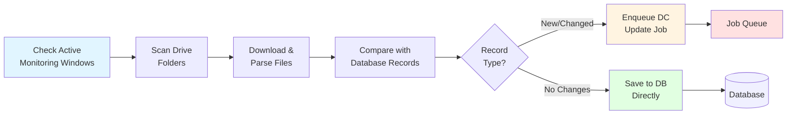
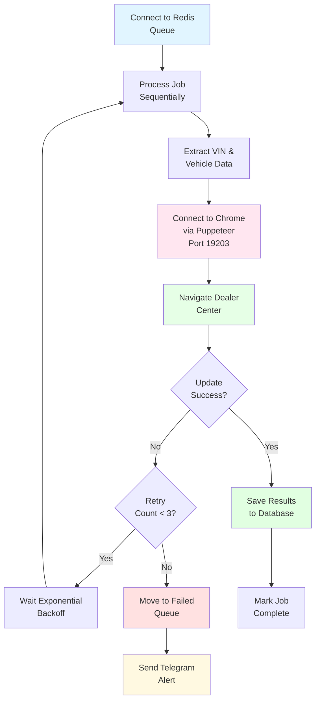
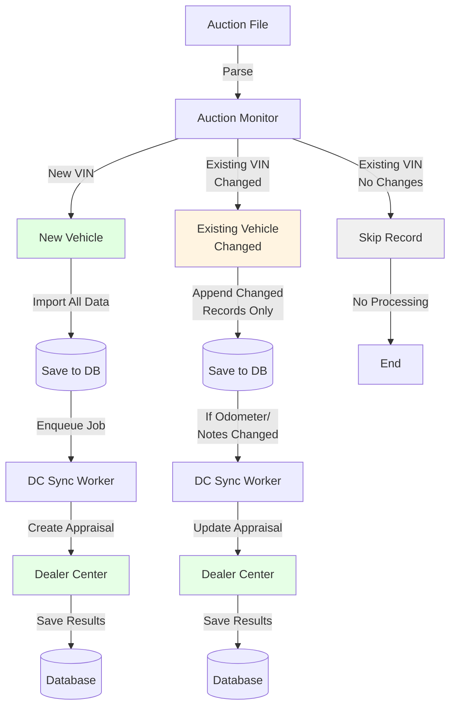

# Architecture Overview

High-level architecture of the Scrape Engine system.

## System Components



## Worker Architecture

### Producer: Auction Monitor

**Responsibilities:**
- Monitor Google Drive folders on schedule
- Detect auction files (CSV/Sheets)
- Parse vehicle data
- Detect changes (new vs. existing VINs)
- Enqueue DC update jobs
- Save DB-only records directly

**Flow:**



### Consumer: DC Sync Worker

**Responsibilities:**
- Process jobs from BullMQ queue
- Update Dealer Center via Puppeteer
- Save results to database
- Handle retries and failures
- Send alerts on errors

**Flow:**



**Why Sequential Processing?**
- Puppeteer browser instances conflict when run in parallel
- Dealer Center may throttle concurrent requests
- Sequential processing ensures stability and reliability

### Job Queue System

**Technology:** BullMQ with Redis

**Queue:** `dc-update-queue`

**Job Types:**
- `DC_UPDATE_JOB`: Vehicle record needing Dealer Center sync

**Job Data:**
```typescript
{
  record: AdesaRecord | EdgePipelineRecord,
  isNewRecord: boolean,
  auctionType: 'Adesa' | 'Edge Pipeline',
  fileId: string,
  fileName: string,
  timestamp: Date
}
```

**Job Configuration:**
- **Concurrency:** 1 (sequential processing)
- **Attempts:** 3 retries
- **Backoff:** Exponential (1s, 2s, 4s)
- **Timeout:** 5 minutes per job
- **Deduplication:** By VIN (prevents duplicate processing)

## Data Flow



## Monitoring Schedules

### Adesa Auction
- **Day:** Wednesday
- **Monitor Start:** Friday before auction
- **Monitor End:** Wednesday 12 PM
- **File Pattern:** `adesa-MM-DD-YYYY.csv`

### Edge Auction
- **Day:** Thursday
- **Monitor Start:** Monday of auction week
- **Monitor End:** Thursday (end of day)
- **File Pattern:** `edge-MM-DD-YYYY.csv`

## Error Handling

### Blocked VINs
When a VIN encounters an uncovered case:
1. VIN automatically blocked in Redis
2. Telegram alert sent with details
3. Future processing skipped
4. Manual unblock after fix

### Job Failures
- Automatic retry: 3 attempts with exponential backoff
- On final failure: Move to failed queue, send Telegram alert
- Manual retry available via dashboard

### System Failures
- **Producer crash:** Jobs remain in Redis, consumer continues
- **Consumer crash:** Jobs remain in queue, resume on restart
- **Redis connection lost:** Automatic reconnection with retry
- **Database connection lost:** Automatic reconnection with retry

## Technology Stack

- **Runtime:** Node.js 18+ with TypeScript
- **Database:** PostgreSQL with Prisma ORM
- **Job Queue:** BullMQ with Redis
- **Automation:** Puppeteer for Dealer Center interaction
- **Cloud Storage:** Google Drive API
- **Notifications:** Telegram Bot API
- **Process Manager:** PM2 (production)

## Scalability

**Current Limits:**
- 1 DC sync worker (sequential processing required)
- Multiple auction monitors can run (one per auction type)

**Future Enhancements:**
- Priority queues for urgent updates
- Batch processing for multiple records
- Rate limiting for DC updates
- Multi-tenant support with separate queues

