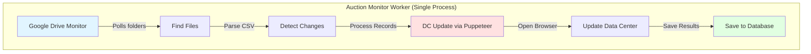
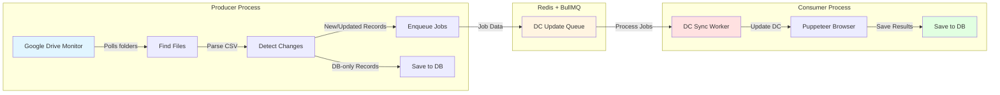
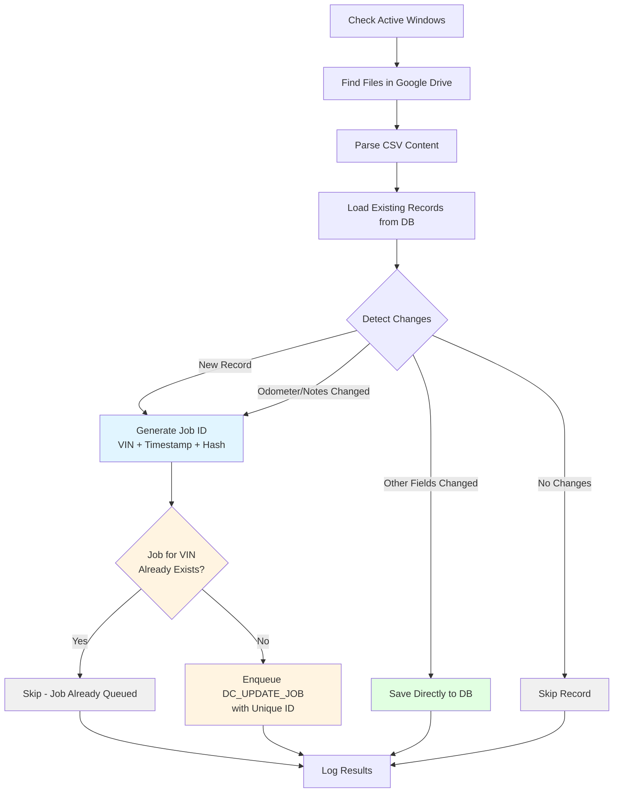
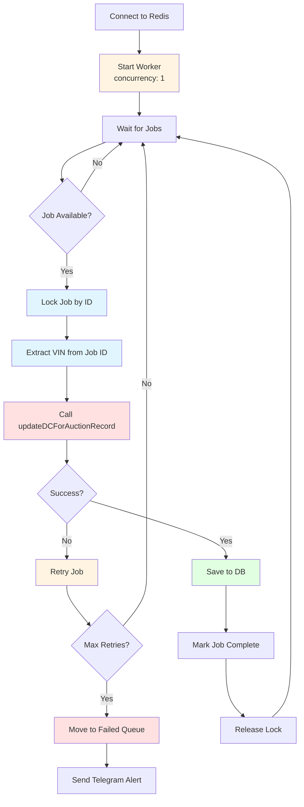
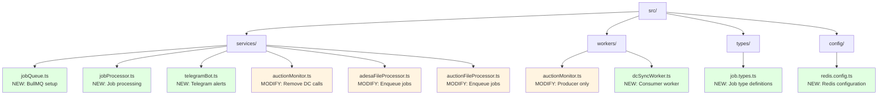
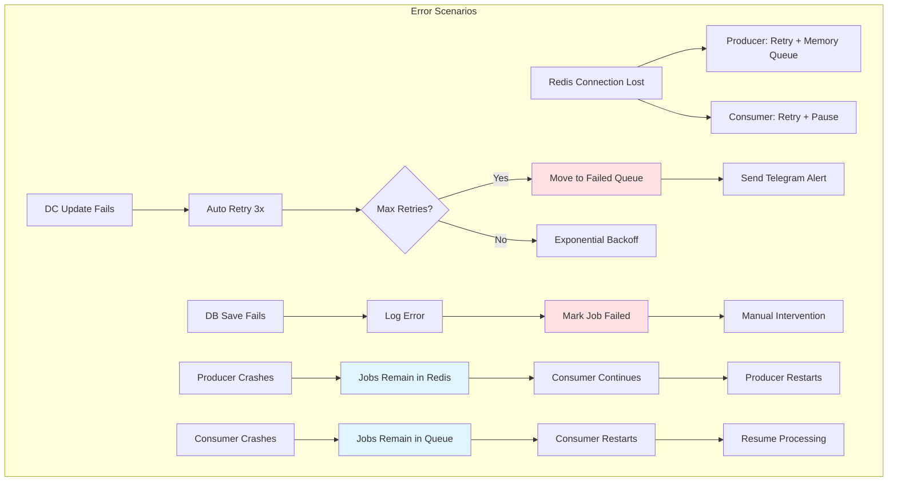
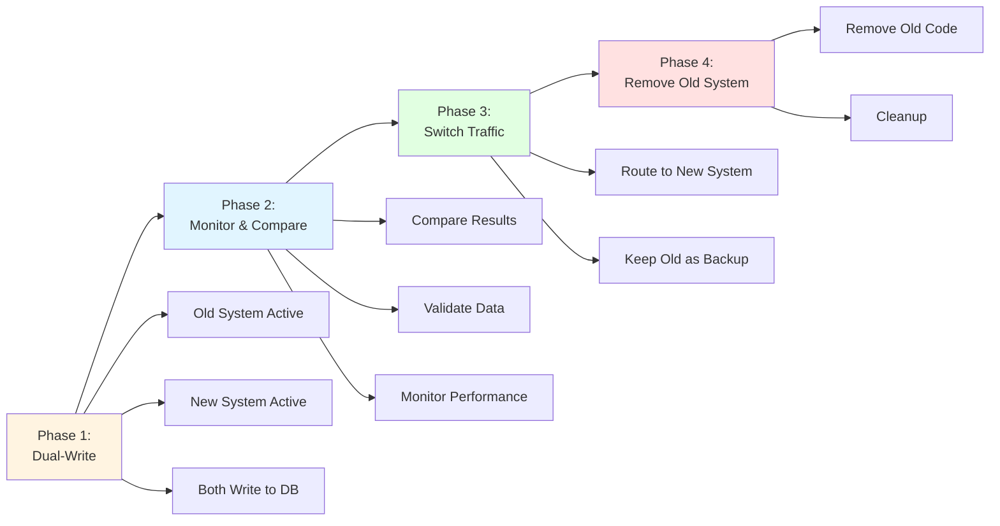

# Architecture Plan: Separated Google Drive Monitor & DC Sync

## Overview

This document outlines the plan to separate Google Drive monitoring from Data Center (DC) syncing into two independent processes using Redis and BullMQ for job queuing.

## Current Architecture (Monolithic)



**Problems:**
- Google Drive API and Puppeteer in same process can conflict
- Long-running DC updates block file monitoring
- No retry mechanism for failed DC updates
- Difficult to scale or monitor separately
- Single point of failure

## Proposed Architecture (Separated)



## Benefits

1. **Separation of Concerns**: Each process has a single responsibility
2. **Scalability**: Can run multiple DC workers for parallel processing
3. **Resilience**: Jobs persist in Redis, survive crashes
4. **Monitoring**: BullMQ provides built-in job monitoring
5. **Retry Logic**: Automatic retries with exponential backoff
6. **Performance**: Monitor continues working while DC updates process
7. **Flexibility**: Can pause/resume workers independently

## Components

### 1. Job Queue System (BullMQ)

**Queue Name**: `dc-update-queue`

**Job Types**:
- `DC_UPDATE_JOB`: For records needing DC update
  - New records (full appraisal)
  - Updated records (odometer/notes changed)

**Job Data Structure**:
```typescript
interface DCUpdateJobData {
  record: AdesaRecord | EdgePipelineRecord;
  isNewRecord: boolean;
  auctionType: 'Adesa' | 'Edge Pipeline';
  fileId: string;
  fileName: string;
  timestamp: Date;
}
```

**Job ID Strategy**:
- **Format**: `dc-update-{VIN}-{timestamp}-{hash}`
- **Example**: `dc-update-1HGBH41JXMN109186-1703123456789-a1b2c3d4`
- **Uniqueness**: VIN + timestamp ensures uniqueness
- **Deduplication**: Check if job with same VIN is already in queue/processing

**Job Options**:
- `jobId`: Custom ID based on VIN + timestamp + hash (prevents duplicates)
- `concurrency`: 1 (process only one job at a time - critical for Puppeteer)
- `attempts`: 3 (retry 3 times on failure)
- `backoff`: Exponential backoff (1s, 2s, 4s)
- `removeOnComplete`: Keep last 100 completed jobs
- `removeOnFail`: Keep last 50 failed jobs
- `timeout`: 5 minutes per job
- `lockDuration`: 5 minutes (prevent other workers from picking up same job)

**Concurrency Control**:
```typescript
// Worker configuration
const worker = new Worker('dc-update-queue', processor, {
  connection: redisConnection,
  concurrency: 1, // CRITICAL: Only one job at a time
  limiter: {
    max: 1,        // Max 1 job
    duration: 1000 // Per second (effectively sequential)
  }
});
```

**Job Deduplication Logic**:
```typescript
// Before enqueueing, check if job for this VIN already exists
async function enqueueDCUpdateJob(data: DCUpdateJobData): Promise<Job> {
  const jobId = generateJobId(data.record.vin, data.timestamp);
  
  // Check if job with same VIN is already queued or processing
  const existingJobs = await queue.getJobs(['waiting', 'active', 'delayed']);
  const duplicateJob = existingJobs.find(job => 
    job.data.record.vin === data.record.vin
  );
  
  if (duplicateJob) {
    console.log(`Job for VIN ${data.record.vin} already exists, skipping`);
    return duplicateJob;
  }
  
  return queue.add('DC_UPDATE_JOB', data, {
    jobId, // Use custom ID
    attempts: 3,
    backoff: {
      type: 'exponential',
      delay: 1000,
    },
    removeOnComplete: 100,
    removeOnFail: 50,
    timeout: 5 * 60 * 1000, // 5 minutes
  });
}
```

### 2. Google Drive Monitor (Producer)

**Responsibilities**:
- Monitor Google Drive folders based on schedule
- Parse CSV files
- Detect changes (new vs updated records)
- Enqueue DC update jobs for records needing DC sync
- Save DB-only records directly (no DC update needed)
- Report monitoring status

**Process Flow**:



**Job Enqueueing with Deduplication**:
1. Generate unique job ID: `dc-update-{VIN}-{timestamp}-{hash}`
2. Check if job with same VIN already exists in queue (waiting/active/delayed)
3. If exists → Skip enqueueing (prevent duplicates)
4. If not exists → Enqueue with custom jobId
5. Log job ID for tracking

**Files to Modify**:
- `src/services/auctionMonitor.ts` - Remove DC update calls
- `src/services/adesaFileProcessor.ts` - Enqueue jobs instead of calling DC
- `src/services/auctionFileProcessor.ts` - Enqueue jobs instead of calling DC
- `src/workers/auctionMonitor.ts` - Update worker entry point

**New Files**:
- `src/services/jobQueue.ts` - BullMQ queue setup and job enqueueing
- `src/types/job.types.ts` - Job data type definitions
- `src/services/telegramBot.ts` - Telegram bot service for alerts

### 3. DC Sync Worker (Consumer)

**Responsibilities**:
- Process jobs from BullMQ queue
- Call DC update function (Puppeteer)
- Save to DB after successful DC update
- Handle retries and failures
- Report job status

**Process Flow**:



**Job ID Handling**:
- Each job has unique ID: `dc-update-{VIN}-{timestamp}-{hash}`
- Job ID is used for:
  - Deduplication (prevent same VIN from being processed twice)
  - Tracking (monitor specific job status)
  - Locking (ensure only one job processes at a time)

**New Files**:
- `src/workers/dcSyncWorker.ts` - Main worker entry point
- `src/services/jobProcessor.ts` - Job processing logic
- `src/services/telegramBot.ts` - Telegram bot for failure alerts

**Job ID Generation**:
```typescript
import { createHash } from 'crypto';

function generateJobId(vin: string, timestamp: Date): string {
  const timestampStr = timestamp.getTime().toString();
  const hash = createHash('md5')
    .update(`${vin}-${timestampStr}`)
    .digest('hex')
    .substring(0, 8);
  
  return `dc-update-${vin}-${timestampStr}-${hash}`;
}
```

**Job Event Handling**:
Each job emits events that can be tracked:
- `completed`: Job finished successfully
- `failed`: Job failed after max retries
- `active`: Job started processing
- `stalled`: Job took too long (timeout)
- `progress`: Job progress updates (optional)

**Tracking Job Status by VIN**:
```typescript
// Get job status for a specific VIN
async function getJobStatusByVin(vin: string): Promise<Job | null> {
  const jobs = await queue.getJobs(['waiting', 'active', 'completed', 'failed']);
  return jobs.find(job => job.data.record.vin === vin) || null;
}
```

## Implementation Plan

### Phase 1: Setup Infrastructure

1. **Install Dependencies**
   ```bash
   npm install bullmq ioredis node-telegram-bot-api
   npm install --save-dev @types/ioredis @types/node-telegram-bot-api
   ```

2. **Environment Variables**
   ```env
   REDIS_HOST=localhost
   REDIS_PORT=6379
   REDIS_PASSWORD=  # Optional
   REDIS_DB=0
   
   # Telegram Bot Configuration
   TELEGRAM_BOT_TOKEN=your_bot_token_here
   TELEGRAM_CHAT_ID=your_chat_id_here
   ```

3. **Create Job Queue Service**
   - `src/services/jobQueue.ts`
   - Initialize BullMQ queue
   - Export enqueue functions with deduplication
   - Implement job ID generation (VIN-based)

4. **Create Job Types**
   - `src/types/job.types.ts`
   - Define job data interfaces
   - Define job ID format

5. **Configure Worker Concurrency**
   - Set `concurrency: 1` in worker config
   - Ensure only one job processes at a time
   - Prevent Puppeteer conflicts

### Phase 2: Refactor Producer (Google Drive Monitor)

1. **Update File Processors**
   - Remove direct DC update calls
   - Add job enqueueing logic
   - Keep DB-only saves inline

2. **Update Auction Monitor**
   - Remove DC update result tracking
   - Add job enqueueing status tracking

3. **Test Producer**
   - Verify jobs are enqueued correctly
   - Check Redis for job data

### Phase 3: Create Consumer (DC Sync Worker)

1. **Create Job Processor**
   - Process DC_UPDATE_JOB
   - Extract VIN from job ID
   - Call DC update function
   - Save to DB on success
   - Handle errors
   - Emit job events

2. **Create Worker Entry Point**
   - Initialize worker with `concurrency: 1`
   - Handle graceful shutdown
   - Add logging with job IDs
   - Track job status by VIN

3. **Test Consumer**
   - Process jobs from queue (one at a time)
   - Verify DC updates work
   - Test retry logic
   - Verify job ID uniqueness
   - Test deduplication (same VIN)

### Phase 4: Monitoring & Error Handling

1. **Add Job Status Tracking**
   - Log job progress
   - Track success/failure rates
   - Monitor queue length

2. **Error Handling**
   - Dead letter queue for failed jobs
   - Telegram bot alerts on failures
   - Manual retry mechanism

3. **Health Checks**
   - Producer health (can connect to Redis)
   - Consumer health (processing jobs)
   - Queue health (not backing up)

4. **Telegram Bot Integration**
   - Send alerts on job failures
   - Send alerts on repeated failures
   - Send alerts on queue backup
   - Send alerts on system health issues

## File Structure



## Running the System

### Development

**Terminal 1 - Producer (Google Drive Monitor)**:
```bash
npm run start:monitor
```

**Terminal 2 - Consumer (DC Sync Worker)**:
```bash
npm run start:dc-sync
```

### Production

Use process managers like PM2:
```bash
pm2 start src/workers/auctionMonitor.ts --name "drive-monitor"
pm2 start src/workers/dcSyncWorker.ts --name "dc-sync" -i 2  # 2 instances
```

## Monitoring

### Telegram Bot Alerts

**Installation**:
```bash
npm install node-telegram-bot-api
npm install --save-dev @types/node-telegram-bot-api
```

**Alert Types**:
1. **Job Failure Alerts**
   - Sent when job fails after max retries
   - Includes: VIN, job ID, error message, timestamp
   - Format: `❌ DC Update Failed\nVIN: {vin}\nJob ID: {jobId}\nError: {error}\nTime: {timestamp}`

2. **Queue Backup Alerts**
   - Sent when queue length exceeds threshold (e.g., > 100)
   - Includes: Queue length, oldest job timestamp
   - Format: `⚠️ Queue Backup Alert\nQueue Length: {count}\nOldest Job: {timestamp}`

3. **System Health Alerts**
   - Sent when producer/consumer crashes
   - Sent when Redis connection lost
   - Format: `🚨 System Health Alert\nComponent: {component}\nStatus: {status}\nTime: {timestamp}`

4. **Repeated Failure Alerts**
   - Sent when same VIN fails multiple times
   - Includes: VIN, failure count, last error
   - Format: `🔴 Repeated Failure Alert\nVIN: {vin}\nFailures: {count}\nLast Error: {error}`

**Telegram Bot Service**:
```typescript
// src/services/telegramBot.ts
import TelegramBot from 'node-telegram-bot-api';

class TelegramAlertService {
  private bot: TelegramBot;
  private chatId: string;

  constructor(token: string, chatId: string) {
    this.bot = new TelegramBot(token);
    this.chatId = chatId;
  }

  async sendJobFailureAlert(jobId: string, vin: string, error: string): Promise<void> {
    const message = `❌ DC Update Failed\n\n` +
      `VIN: ${vin}\n` +
      `Job ID: ${jobId}\n` +
      `Error: ${error}\n` +
      `Time: ${new Date().toISOString()}`;
    
    await this.bot.sendMessage(this.chatId, message);
  }

  async sendQueueBackupAlert(queueLength: number, oldestJobTime?: Date): Promise<void> {
    const message = `⚠️ Queue Backup Alert\n\n` +
      `Queue Length: ${queueLength}\n` +
      (oldestJobTime ? `Oldest Job: ${oldestJobTime.toISOString()}\n` : '') +
      `Time: ${new Date().toISOString()}`;
    
    await this.bot.sendMessage(this.chatId, message);
  }

  async sendSystemHealthAlert(component: string, status: string): Promise<void> {
    const message = `🚨 System Health Alert\n\n` +
      `Component: ${component}\n` +
      `Status: ${status}\n` +
      `Time: ${new Date().toISOString()}`;
    
    await this.bot.sendMessage(this.chatId, message);
  }

  async sendRepeatedFailureAlert(vin: string, failureCount: number, lastError: string): Promise<void> {
    const message = `🔴 Repeated Failure Alert\n\n` +
      `VIN: ${vin}\n` +
      `Failure Count: ${failureCount}\n` +
      `Last Error: ${lastError}\n` +
      `Time: ${new Date().toISOString()}`;
    
    await this.bot.sendMessage(this.chatId, message);
  }
}
```

### BullMQ Dashboard (Optional)

Install `@bull-board/express` for web dashboard:
```bash
npm install @bull-board/express @bull-board/api
```

### Metrics to Track

- Queue length (jobs waiting)
- Processing rate (jobs/second)
- Success/failure rates
- Average processing time
- Retry counts
- Telegram alerts sent

## Error Scenarios & Handling



## Future Enhancements

1. **Priority Queues**: High-priority jobs for urgent updates
2. **Batch Processing**: Process multiple records in single job
3. **Rate Limiting**: Control DC update rate to avoid overwhelming system
4. **Webhooks**: Notify external systems on job completion
5. **Scheduling**: Schedule jobs for specific times
6. **Multi-tenant**: Support multiple auction types with separate queues

## Migration Strategy



## Job ID & Concurrency Details

### Job ID Format
- **Pattern**: `dc-update-{VIN}-{timestamp}-{hash}`
- **Purpose**: 
  - Uniquely identify each job
  - Enable deduplication by VIN
  - Track job status
  - Prevent duplicate processing

### Concurrency Control
- **Worker Config**: `concurrency: 1` (only one job at a time)
- **Reason**: Puppeteer browser instances conflict if run in parallel
- **Impact**: Sequential processing ensures stability
- **Trade-off**: Slower but reliable

### Deduplication Strategy
1. **Before Enqueueing**: Check if job for same VIN exists
2. **Job States Checked**: `waiting`, `active`, `delayed`
3. **If Duplicate Found**: Skip enqueueing, return existing job
4. **If Not Found**: Enqueue with unique job ID

### Job Lifecycle
```
Created → Waiting → Active → Completed/Failed
                ↓
            (Retry) → Active → Completed/Failed
```

## Questions to Consider

1. Should DB-only updates also go through queue? (Recommendation: No, keep inline)
2. How many DC workers should run? (Recommendation: **Only 1** - concurrency: 1 means sequential processing)
3. What's the max queue size? (Recommendation: Monitor and alert if > 1000)
4. Should we batch multiple records in one job? (Recommendation: No - one job per VIN for better tracking)
5. How to handle same VIN updated multiple times? (Recommendation: Latest job wins, previous job may be cancelled if not started)

